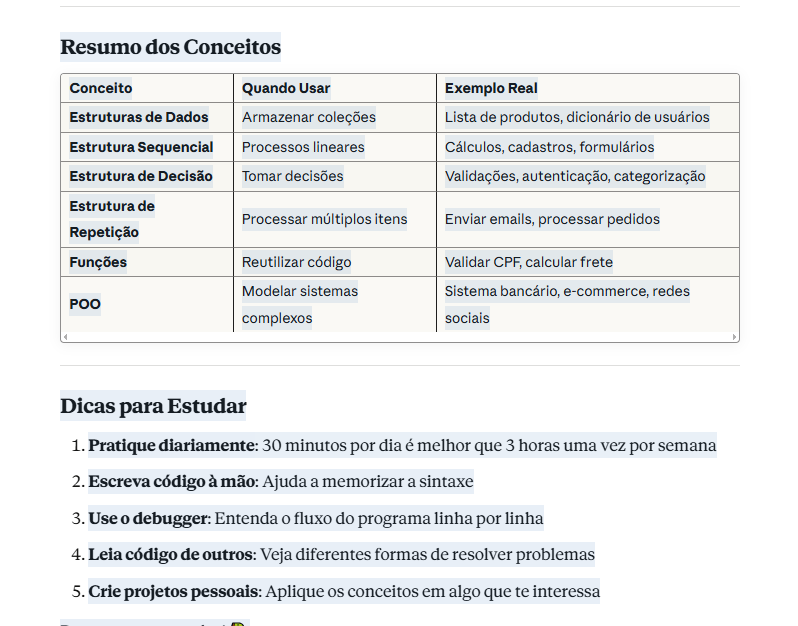

Resumo dos Conceitos
ConceitoQuando UsarExemplo RealEstruturas de DadosArmazenar coleçõesLista de produtos, dicionário de usuáriosEstrutura SequencialProcessos linearesCálculos, cadastros, formuláriosEstrutura de DecisãoTomar decisõesValidações, autenticação, categorizaçãoEstrutura de RepetiçãoProcessar múltiplos itensEnviar emails, processar pedidosFunçõesReutilizar códigoValidar CPF, calcular fretePOOModelar sistemas complexosSistema bancário, e-commerce, redes sociais

Dicas para Estudar

Pratique diariamente: 30 minutos por dia é melhor que 3 horas uma vez por semana
Escreva código à mão: Ajuda a memorizar a sintaxe
Use o debugger: Entenda o fluxo do programa linha por linha
Leia código de outros: Veja diferentes formas de resolver problemas
Crie projetos pessoais: Aplique os conceitos em algo que te interessa

Boa sorte nos estudos! 🐍




# 10 Exercícios Práticos de Python

## 📋 Exercício 1: Sistema de Inventário (Estruturas de Dados)

### Contexto
Você é desenvolvedor de uma loja de games e precisa criar um sistema de inventário que armazena jogos usando diferentes estruturas de dados.

### Objetivo
Criar um programa que:
- Use uma **lista** para armazenar jogos no estoque
- Use um **dicionário** para cada jogo com informações (título, preço, quantidade, plataforma)
- Use um **conjunto** para armazenar plataformas únicas disponíveis
- Use uma **tupla** para armazenar informações imutáveis (código do jogo, data de lançamento)

### Checklist de Resolução
- [ ] Criar uma lista vazia chamada `inventario`
- [ ] Adicionar pelo menos 3 jogos (dicionários) à lista
- [ ] Cada jogo deve ter: título, preço, quantidade, plataforma
- [ ] Criar um conjunto com todas as plataformas únicas
- [ ] Criar uma tupla com código e data para um jogo
- [ ] Imprimir o inventário completo
- [ ] Calcular o valor total do estoque
- [ ] Listar todas as plataformas disponíveis

### Entrada/Saída Esperada
```
=== Inventário de Jogos ===
1. The Witcher 3 - R$ 89.90 - Estoque: 15 - PS5
2. Elden Ring - R$ 199.90 - Estoque: 8 - PC
3. Mario Kart 8 - R$ 299.90 - Estoque: 20 - Switch

Valor total do estoque: R$ 9,348.50
Plataformas disponíveis: {'PS5', 'PC', 'Switch'}
```

---

## 📋 Exercício 2: Calculadora de Pedido de Restaurante (Sequencial)

### Contexto
Você está desenvolvendo o sistema de um restaurante self-service que cobra por peso. O cliente pesa o prato, escolhe a bebida e o programa calcula o total.

### Objetivo
Criar uma calculadora que:
1. Recebe o peso do prato (em gramas)
2. Recebe a escolha da bebida (refrigerante, suco ou água)
3. Pergunta se quer sobremesa (sim/não)
4. Calcula o total com as regras de preço
5. Aplica desconto de 10% se o total for acima de R$ 50

### Regras de Preço
- Comida: R$ 0,045 por grama
- Refrigerante: R$ 6,00
- Suco: R$ 8,00
- Água: R$ 3,00
- Sobremesa: R$ 12,00

### Checklist de Resolução
- [ ] Receber o peso do prato como entrada
- [ ] Calcular o valor da comida (peso × 0.045)
- [ ] Receber a escolha da bebida
- [ ] Calcular o valor da bebida baseado na escolha
- [ ] Perguntar sobre sobremesa
- [ ] Calcular o subtotal
- [ ] Aplicar desconto de 10% se total > R$ 50
- [ ] Exibir o resumo do pedido formatado

### Entrada/Saída Esperada
```
Peso do prato (g): 350
Escolha a bebida (1-Refrigerante, 2-Suco, 3-Água): 2
Deseja sobremesa? (s/n): s

=== RESUMO DO PEDIDO ===
Comida (350g): R$ 15.75
Suco: R$ 8.00
Sobremesa: R$ 12.00
Subtotal: R$ 35.75
Desconto: R$ 0.00
TOTAL: R$ 35.75
```

---

## 📋 Exercício 3: Sistema de Aprovação de Crédito (Decisão)

### Contexto
Você trabalha em uma fintech e precisa criar um sistema automatizado para aprovar ou recusar solicitações de crédito baseado em critérios específicos.

### Objetivo
Criar um programa que:
- Recebe idade, renda mensal e score de crédito
- Aplica regras de decisão para aprovar/recusar
- Define o limite de crédito baseado no perfil
- Classifica o cliente em categorias de risco

### Regras de Aprovação
1. Idade mínima: 18 anos
2. Renda mínima: R$ 1.500
3. Score mínimo: 300

### Cálculo de Limite
- Score >= 700: limite = renda × 3
- Score >= 500: limite = renda × 2
- Score >= 300: limite = renda × 1

### Checklist de Resolução
- [ ] Receber idade, renda e score como entrada
- [ ] Verificar se atende os requisitos mínimos
- [ ] Usar if/elif/else para classificar o score
- [ ] Calcular o limite de crédito baseado nas regras
- [ ] Determinar a categoria de risco (Baixo/Médio/Alto)
- [ ] Usar operadores lógicos (and/or)
- [ ] Exibir resultado da análise de forma clara
- [ ] Tratar caso de reprovação adequadamente

### Entrada/Saída Esperada
```
=== ANÁLISE DE CRÉDITO ===
Idade: 28
Renda mensal: R$ 3500.00
Score: 650

✓ CRÉDITO APROVADO
Limite disponível: R$ 7,000.00
Categoria de risco: Médio
Taxa de juros: 3.5% a.m.
```

---

## 📋 Exercício 4: Processador de Notas de Alunos (Repetição)

### Contexto
Você é desenvolvedor de um sistema educacional e precisa processar as notas de uma turma, calculando estatísticas e identificando aprovações/reprovações.

### Objetivo
Criar um programa que:
- Recebe uma lista de alunos com suas 4 notas
- Calcula a média de cada aluno
- Determina se foi aprovado (média >= 7)
- Calcula estatísticas da turma (média geral, maior nota, menor nota)
- Lista os alunos aprovados e reprovados

### Checklist de Resolução
- [ ] Criar uma lista com dicionários de alunos (nome e 4 notas)
- [ ] Usar loop for para processar cada aluno
- [ ] Calcular a média de cada aluno dentro do loop
- [ ] Adicionar campo "situacao" (Aprovado/Reprovado)
- [ ] Calcular a média geral da turma
- [ ] Encontrar maior e menor média usando max() e min()
- [ ] Usar list comprehension para filtrar aprovados
- [ ] Exibir relatório completo formatado

### Entrada Exemplo
```python
alunos = [
    {"nome": "Ana Silva", "notas": [8.5, 7.0, 9.0, 8.0]},
    {"nome": "João Santos", "notas": [6.0, 5.5, 6.5, 7.0]},
    {"nome": "Maria Costa", "notas": [9.0, 9.5, 8.5, 10.0]},
    {"nome": "Pedro Oliveira", "notas": [5.0, 6.0, 4.5, 5.5]}
]
```

### Saída Esperada
```
=== RELATÓRIO DE DESEMPENHO ===

Ana Silva - Média: 8.13 - ✓ APROVADO
João Santos - Média: 6.25 - ✗ REPROVADO
Maria Costa - Média: 9.25 - ✓ APROVADO
Pedro Oliveira - Média: 5.25 - ✗ REPROVADO

=== ESTATÍSTICAS DA TURMA ===
Total de alunos: 4
Aprovados: 2 (50.0%)
Reprovados: 2 (50.0%)
Média geral: 7.22
Maior média: 9.25 (Maria Costa)
Menor média: 5.25 (Pedro Oliveira)
```

---

## 📋 Exercício 5: Validador de Dados (Funções)

### Contexto
Você está desenvolvendo funções de validação reutilizáveis para um sistema de cadastro de usuários em um e-commerce.

### Objetivo
Criar funções para validar:
- CPF (formato XXX.XXX.XXX-XX)
- Email (deve conter @ e domínio)
- Senha forte (mínimo 8 caracteres, letra maiúscula, minúscula e número)
- Telefone (formato (XX) XXXXX-XXXX)
- CEP (formato XXXXX-XXX)

### Checklist de Resolução
- [ ] Criar função `validar_cpf(cpf)` que retorna True/False
- [ ] Criar função `validar_email(email)` que verifica @ e ponto
- [ ] Criar função `validar_senha(senha)` com todas as regras
- [ ] Criar função `validar_telefone(telefone)` que verifica formato
- [ ] Criar função `validar_cep(cep)` que verifica formato
- [ ] Criar função principal `validar_cadastro()` que usa todas as outras
- [ ] Adicionar mensagens de erro específicas
- [ ] Testar com dados válidos e inválidos

### Exemplo de Uso
```python
# Teste
dados = {
    "cpf": "123.456.789-00",
    "email": "usuario@email.com",
    "senha": "Senha123",
    "telefone": "(11) 98765-4321",
    "cep": "12345-678"
}

validar_cadastro(dados)
```

### Saída Esperada
```
=== VALIDAÇÃO DE CADASTRO ===
✓ CPF válido
✓ Email válido
✓ Senha forte
✓ Telefone válido
✓ CEP válido

Cadastro aprovado! Todos os dados estão corretos.
```

---

## 📋 Exercício 6: Gerador de Relatório de Vendas (Funções + Listas)

### Contexto
Você trabalha em uma empresa e precisa criar funções para gerar relatórios de vendas mensais com estatísticas e análises.

### Objetivo
Criar funções que:
- Calculam o total de vendas
- Encontram o dia de maior e menor venda
- Calculam a média diária
- Identificam dias acima da média
- Geram relatório formatado

### Checklist de Resolução
- [ ] Criar função `calcular_total(vendas)` que soma todas as vendas
- [ ] Criar função `calcular_media(vendas)` que retorna a média
- [ ] Criar função `maior_venda(vendas)` que retorna valor e dia
- [ ] Criar função `menor_venda(vendas)` que retorna valor e dia
- [ ] Criar função `dias_acima_media(vendas, media)` que retorna lista
- [ ] Criar função `gerar_relatorio(vendas)` que usa todas as funções
- [ ] Usar f-strings para formatação de valores monetários
- [ ] Testar com dados de vendas de um mês

### Entrada Exemplo
```python
vendas_janeiro = [
    1500.00, 2300.00, 1800.00, 2100.00, 1900.00,
    2500.00, 2200.00, 1700.00, 2400.00, 2000.00,
    1600.00, 2300.00, 1950.00, 2150.00, 1850.00
]
```

### Saída Esperada
```
=== RELATÓRIO DE VENDAS - JANEIRO ===
Total de vendas: R$ 30,250.00
Média diária: R$ 2,016.67

Melhor dia: Dia 6 - R$ 2,500.00
Pior dia: Dia 1 - R$ 1,500.00

Dias acima da média: 8 dias
Percentual de dias bons: 53.33%
```

---

## 📋 Exercício 7: Sistema de Estacionamento (POO - Básico)

### Contexto
Você foi contratado para desenvolver um sistema de gerenciamento de estacionamento usando Programação Orientada a Objetos.

### Objetivo
Criar classes que representam:
- **Veiculo**: Placa, modelo, cor, hora de entrada
- **Estacionamento**: Vagas totais, vagas ocupadas, lista de veículos, preço por hora

### Funcionalidades
- Registrar entrada de veículo
- Registrar saída e calcular valor
- Verificar disponibilidade de vagas
- Listar veículos estacionados

### Checklist de Resolução
- [ ] Criar classe `Veiculo` com __init__ para placa, modelo, cor
- [ ] Adicionar atributo `hora_entrada` em Veiculo
- [ ] Criar classe `Estacionamento` com vagas_totais e preco_hora
- [ ] Implementar método `registrar_entrada(veiculo)`
- [ ] Implementar método `registrar_saida(placa)` que calcula valor
- [ ] Implementar método `vagas_disponiveis()` que retorna número
- [ ] Implementar método `listar_veiculos()` para exibir todos
- [ ] Usar import datetime para calcular tempo
- [ ] Tratar caso de estacionamento lotado
- [ ] Testar com pelo menos 3 veículos

### Saída Esperada
```
=== Sistema de Estacionamento ===
✓ Veículo ABC-1234 estacionado (15:30)
✓ Veículo XYZ-5678 estacionado (15:45)
Vagas disponíveis: 48/50

--- Saída ---
Veículo: ABC-1234
Tempo: 2 horas e 15 minutos
Valor: R$ 15.00

Vagas disponíveis: 49/50
```

---

## 📋 Exercício 8: Sistema Bancário com Herança (POO - Intermediário)

### Contexto
Você precisa modelar diferentes tipos de contas bancárias (Conta Corrente, Conta Poupança e Conta Empresarial) que compartilham comportamentos comuns mas têm regras específicas.

### Objetivo
Criar hierarquia de classes:
- **ContaBancaria** (classe base): titular, saldo, numero_conta
- **ContaCorrente**: permite cheque especial (limite negativo)
- **ContaPoupanca**: rende juros mensais
- **ContaEmpresarial**: tem limite de transações e taxas

### Regras Específicas
- Conta Corrente: pode ficar negativa até o limite do cheque especial
- Conta Poupança: rende 0.5% ao mês
- Conta Empresarial: taxa de R$ 20 por transação acima de 10 no mês

### Checklist de Resolução
- [ ] Criar classe base `ContaBancaria` com atributos comuns
- [ ] Implementar métodos `depositar()` e `sacar()` na base
- [ ] Criar classe `ContaCorrente` herdando de ContaBancaria
- [ ] Adicionar atributo `limite_cheque_especial` na ContaCorrente
- [ ] Sobrescrever método `sacar()` para permitir negativo
- [ ] Criar classe `ContaPoupanca` com método `render_juros()`
- [ ] Criar classe `ContaEmpresarial` com contador de transações
- [ ] Implementar método `cobrar_taxa()` se transações > 10
- [ ] Testar cada tipo de conta
- [ ] Demonstrar polimorfismo (mesma interface, comportamentos diferentes)

### Saída Esperada
```
=== Teste de Contas ===

[Conta Corrente - João Silva]
Saldo inicial: R$ 1,000.00
Saque de R$ 1,200.00
✓ Saque realizado (cheque especial)
Saldo atual: R$ -200.00

[Conta Poupança - Maria Santos]
Saldo inicial: R$ 5,000.00
Rendimento mensal aplicado
Saldo após juros: R$ 5,025.00

[Conta Empresarial - Tech LTDA]
Saldo inicial: R$ 10,000.00
Transações no mês: 12
Taxa cobrada: R$ 240.00
Saldo atual: R$ 9,760.00
```

---

## 📋 Exercício 9: Sistema de E-commerce com Carrinho (POO - Avançado)

### Contexto
Você está desenvolvendo um sistema de e-commerce completo com produtos, carrinho de compras e processamento de pedidos usando POO.

### Objetivo
Criar um sistema com:
- **Produto**: código, nome, preço, categoria, estoque
- **ItemCarrinho**: produto e quantidade
- **Carrinho**: lista de itens, métodos para adicionar/remover
- **Pedido**: carrinho, cliente, status, forma de pagamento

### Funcionalidades
- Adicionar produtos ao carrinho
- Calcular subtotal e total com frete
- Aplicar cupons de desconto
- Finalizar pedido
- Validar estoque

### Checklist de Resolução
- [ ] Criar classe `Produto` com todos os atributos
- [ ] Implementar método `esta_disponivel(quantidade)` em Produto
- [ ] Criar classe `ItemCarrinho` que contém produto e quantidade
- [ ] Criar classe `Carrinho` com lista de itens
- [ ] Implementar método `adicionar_item(produto, quantidade)`
- [ ] Implementar método `remover_item(codigo_produto)`
- [ ] Implementar método `calcular_subtotal()`
- [ ] Implementar método `aplicar_cupom(codigo, desconto)`
- [ ] Criar classe `Pedido` que recebe carrinho
- [ ] Implementar método `finalizar()` que valida estoque
- [ ] Calcular frete baseado no subtotal
- [ ] Exibir resumo completo do pedido

### Saída Esperada
```
=== CARRINHO DE COMPRAS ===
1. Notebook Dell - R$ 3,500.00 x 1 = R$ 3,500.00
2. Mouse Logitech - R$ 150.00 x 2 = R$ 300.00
3. Teclado Mecânico - R$ 450.00 x 1 = R$ 450.00

Subtotal: R$ 4,250.00
Cupom "PRIMEIRACOMPRA": -R$ 212.50 (5%)
Frete: R$ 50.00
TOTAL: R$ 4,087.50

✓ Pedido #1001 finalizado com sucesso!
```

---

## 📋 Exercício 10: Sistema de Biblioteca com Polimorfismo (POO - Completo)

### Contexto
Você foi contratado para criar um sistema completo de biblioteca que gerencia diferentes tipos de itens (livros, revistas, DVDs) com regras de empréstimo específicas para cada tipo.

### Objetivo
Criar um sistema orientado a objetos que:
- Modela diferentes tipos de itens da biblioteca
- Implementa sistema de empréstimos com datas
- Calcula multas por atraso
- Gerencia usuários e histórico

### Classes Necessárias
- **ItemBiblioteca** (abstrata): título, código, ano, disponível
- **Livro**: autor, ISBN, número de páginas (empréstimo: 14 dias)
- **Revista**: edição, mês (empréstimo: 7 dias)
- **DVD**: duração, diretor (empréstimo: 3 dias)
- **Usuario**: nome, CPF, itens emprestados
- **Emprestimo**: item, usuário, data empréstimo, data devolução
- **Biblioteca**: catálogo de itens, lista de usuários

### Regras de Negócio
- Cada tipo de item tem prazo diferente
- Multa: R$ 2,00 por dia de atraso
- Usuário pode ter no máximo 3 itens emprestados
- Item só pode ser emprestado se estiver disponível

### Checklist de Resolução
- [ ] Criar classe abstrata `ItemBiblioteca` com método abstrato `prazo_emprestimo()`
- [ ] Criar classes `Livro`, `Revista`, `DVD` herdando de ItemBiblioteca
- [ ] Implementar método `prazo_emprestimo()` em cada classe
- [ ] Criar classe `Usuario` com limite de empréstimos
- [ ] Criar classe `Emprestimo` com datas e cálculo de multa
- [ ] Criar classe `Biblioteca` para gerenciar tudo
- [ ] Implementar método `emprestar(usuario, item)`
- [ ] Implementar método `devolver(emprestimo)`
- [ ] Implementar método `calcular_multa(emprestimo)`
- [ ] Usar datetime para trabalhar com datas
- [ ] Validar todas as regras de negócio
- [ ] Criar método para relatório de empréstimos

### Saída Esperada
```
=== SISTEMA DE BIBLIOTECA ===

[Novo Empréstimo]
Usuário: Ana Silva (CPF: 123.456.789-00)
Item: 1984 - George Orwell (Livro)
Data empréstimo: 01/10/2025
Data devolução prevista: 15/10/2025
✓ Empréstimo registrado

[Devolução]
Item: 1984 - George Orwell
Data prevista: 15/10/2025
Data real: 20/10/2025
Dias de atraso: 5
Multa: R$ 10.00
✓ Devolução registrada

[Relatório de Empréstimos Ativos]
Ana Silva:
  • Revista Veja - Ed. 234 (vence em 2 dias)
  • DVD Interestelar (vence em 1 dia)
Total: 2 itens emprestados
```

---

## 🎯 Dicas para Resolver os Exercícios

### Estratégia de Estudo
1. **Leia o contexto**: Entenda o problema do mundo real
2. **Analise o checklist**: Ele é um roteiro passo a passo
3. **Escreva pseudocódigo**: Antes de codificar, planeje
4. **Teste incrementalmente**: Não espere terminar tudo para testar
5. **Compare com a saída esperada**: Seu resultado deve ser similar

### Ordem Recomendada
- **Iniciante**: Comece pelos exercícios 1, 2, 3
- **Intermediário**: Faça 4, 5, 6, 7
- **Avançado**: Desafie-se com 8, 9, 10

### Recursos Adicionais
- Use o Python Tutor para visualizar execução
- Teste cada função isoladamente
- Adicione prints para debugar
- Consulte a documentação oficial do Python

### Bônus: Desafios Extras
Após resolver cada exercício, tente:
- Adicionar validação de entrada
- Criar interface de menu
- Salvar dados em arquivo
- Adicionar testes unitários
- Melhorar a formatação da saída

---

## 📚 Conclusão

Estes exercícios cobrem os principais conceitos de Python:
- ✅ Estruturas de dados (Exercício 1)
- ✅ Estrutura sequencial (Exercício 2)
- ✅ Estrutura de decisão (Exercício 3)
- ✅ Estrutura de repetição (Exercício 4)
- ✅ Funções (Exercícios 5 e 6)
- ✅ POO básico (Exercício 7)
- ✅ POO com herança (Exercício 8)
- ✅ POO avançado (Exercícios 9 e 10)

**Lembre-se**: A prática leva à perfeição. Resolva cada exercício com calma, seguindo o checklist, e não tenha medo de errar. Cada erro é uma oportunidade de aprendizado!

Bons estudos e boa codificação! 🐍💻